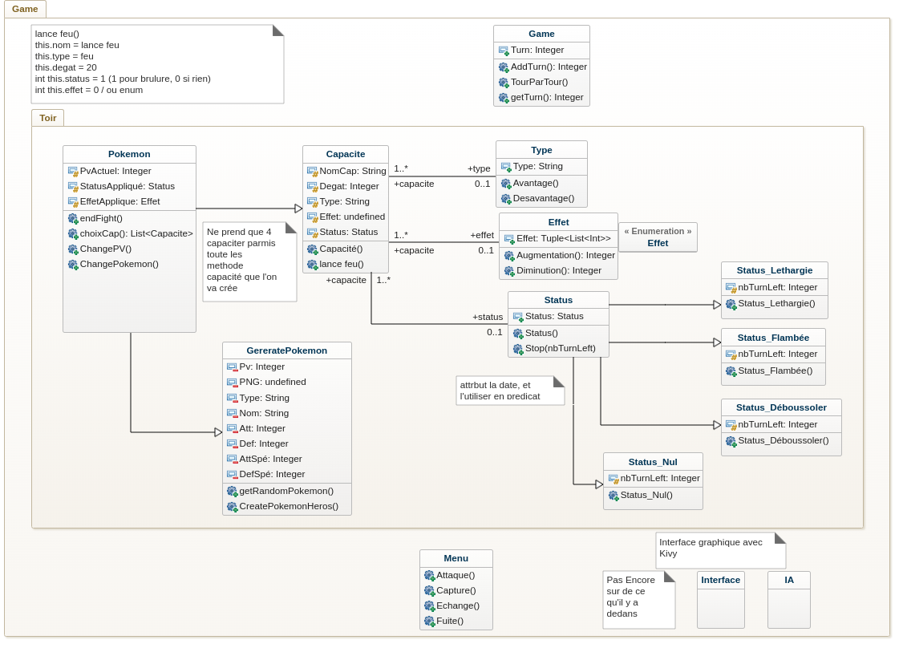
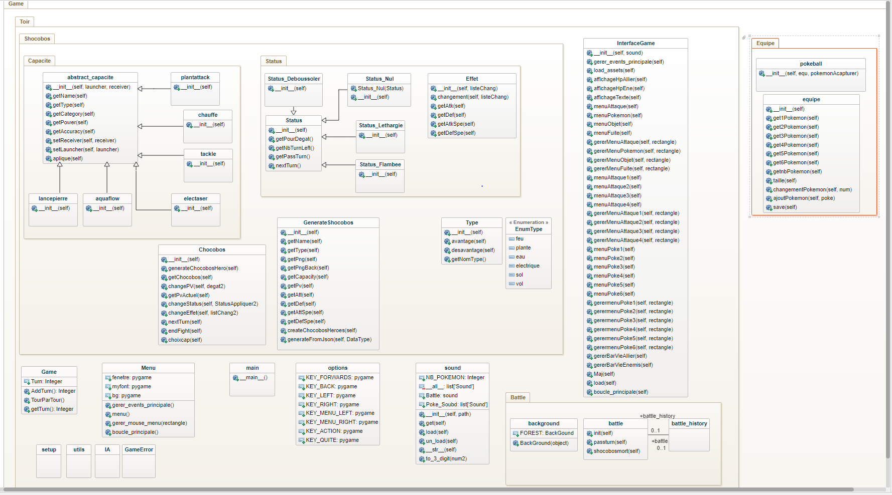
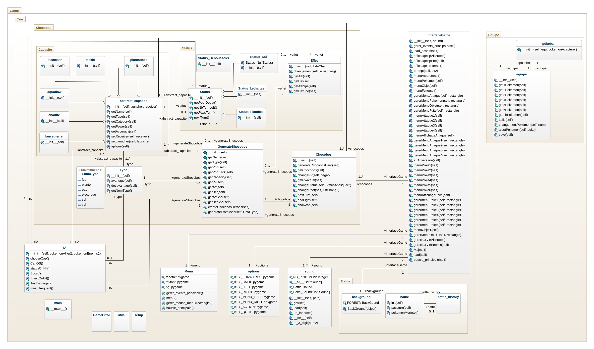

# L3-S6-Projet

## Name
Toir

## Description

## Usage
Python et Kivy/pygame (a voir)

## Roadmap et a faire 
- ajout d'un deuxieme pokemon pour double battle 
- ajout du double type
- ajout d'animation
- ajout musique lancement / cri pokemon / musique differente lors de fin de vie
- ajout des status sur attaque
- ajout d'un multiple *1.5 si le pokemon et de type feu et lance une attaque de type feu
- ajouter differente pokeball pour capture
- ajouter le timer entre les deux attaque car la le timer ce lance et a la fin de celui ci il lance les deux attaque (FAIT)
- ajout de test et doctest (PRIORITE !!!)
- preparer le rapport de projet (PRIORITE !!!)
- ajout des pp

## Authors

### PEREIRA Isack & LEAL CARVLHO Nicolas

## Project status

## Uml

 1er Uml 

 

 2em Uml (sans toute les relations) 

 

 Uml 

 

## Avancement du projet

04/01/23 - 10/01/23 : 

- Reflexion du Projet a effectuer 
- Malgre de nombreuse idée nous nous somme decidé de faire une sorte de jeu Pokemon soit un RPG

11/01/23 - 17/01/23 : 

- Mise en place d'un UML de Base avec très probablement un évolution à l'avenir
- Creation des classes vides pour certaine d'entre elle

18/01/23 - 24/01/23 : 

- debut de code pour certaine des classes
- Code pour la classe Type
- Code pour la classe GenerateChocobos, ainsi qu'un debut pour Chocobos
- Code pour la classe Effet
- Debut de code pour les classes Status

25/01/23 - 31/01/23 : 

- Remise en question du modele, création de nouvelle classe, en quelque sorte une restructuration du projet
- Ajout d'assets pour les utilisation a venir
- Code pour la classe option qui permettra les deplacement dans les menu, et les attaque etc
- Nous avons decidé de partir sur pygame apres une tentative avec kivy 
- Mise a jour du readme

01/02/23 - 07/02/23 :
- Ajout de fonctionnalité par rapport a l'affichage
- Mise en place des fonctionnalité sound
- Mise en place des differentes barre de pv
- Mise en place du randomize des pokemon en ennemis
- Mise a jour du readme

08/02/23 - 15/02/23 :
- Rectification de certaine erreur dans l'affichage (comme pour les pv des shocobos)
- debut de capacite
- debut de battle

17/02/23 - 26/02/23
- Semaine pédagogique

27/02/23 - 03/03/23
- Mise en place de l'equipe 
- Mise en place des different chocobos(pokemonn)
- Ajout des chocobos(pokemon) plus serieusement dans l'affichage
- Concertation sur le mise en place des attaque et des objets

06/03/2023 - 11/03/23
- Mise en place des attaques
- Differente attaque on était crée
- mise en place d'un possible ajout à developper pour les pokemon
- Questionnement, interrogation sur l'IA
- Mise a jour du readme
- Ajout du diagramme UML

13/03/23 - 19/03/23
- Ajout d'une base pour les pokemons qui est parfois trop basse pour les petit pokemons
- Mise en place de l'IA qui va prendre en compte la meilleur option pour pouvoir tuer le pokemon en 1 attaque si possible
- Ajout d'un timer pour les attaque mais ce lance pour les attaque de l'IA et du joueur
- Ajout de different pokemons pour avoir tout les type implementé qui sont representés
- Legere modification de l'interface
- Mise a jour du README 

20/03/23 - 25/03/23
- 

