# Projet : Pokemon

# PEREIRA Isack & LEAL CARVLHO Nicolas

les liens soulignés commençant avec une flèche peuvent être cliqué pour afficher la photo associée 
<details>
<summary><u> Exemple : </u></summary>

Vous avez cliqué sur l'exemple.
</details>
</br>

## <b> Sommaire </b>

## 1. Présentation :
- 1.1 Présentation du jeu :
- 1.2 Présentation du système :

## 2. Modélisation et analyse UML
- 2.1 Diagramme des cas d'utilisation :
- 2.2 Diagramme UML de notre projet :
- 2.3 Diagramme de séquence :
- 2.4 Modélisation permettant le développement d'autres jeux :

## 3. Maquettage
- 3.1 Lancement d'une partie :

## 4. Recette

## 5. Choix et Solution 
- 5.1 Problèmes :
- 5.2 Conception de l'IA :
- 5.3 Améliorations primordiales :
- 5.4 Améliorations subsidiaires :
- 5.5 Nos choix sur la modélisation :
- 5.6 Choix interface :

## 6. Conclusion 

-----------------------------------------------------------------
### <b><u> 1. Présentation :  </b></u>

### <b><u> 1.1 Présentation du jeu : </b></u>
Nous avons décidé de vous proposer un jeu Pokemon, bien sûr on compte sur vous pour garder ce secret car nous n'en avons pas les droits. Il est cependant possible d'utiliser notre projet comme base pour des jeux similaires, pour cela il suffit de modifier les pokemon ainsi que leurs noms et tout ce qui est relié à la licence.

Nous avons décidé de partir sur ce jeu car nous en sommes de grands fans, nous y avons joué pendant notre enfance, et c'était stimulant de tenter de reproduire un jeu similaire, avec nos compétences en essayant de le rendre le plus fidèle possible à l'original.

Nous avons également connecté notre projet avec nos camarades TISSERAND Thibault et YANG Anthony, qui s'occupe de la création de map, et lorsqu'il rencontre un ennemi alors c'est notre jeu qui se lance avec notre système de combat.

Pour pourvoir utiliser la map du projet de TISSERAND Thibault et YANG Anthony [ici](https://gitlab-etu.fil.univ-lille.fr/anthony.yang2.etu/projet-s6-proksima.git), il faut cloner leur projet et mettre le nôtre à la racine du leur et mettre le nom de notre projet dans leur `main.py` ligne 15 à la place de `projet-isack-nico/` plus précisement ici :
```python
def launchFight():
    current_dir = getcwd()
    chdir("projet-isack-nico/")
    program_dir = "src/Game"
    program_name = "main.py"
    program_path = path.join(program_dir, program_name)
    subprocess.call(["/bin/python3", program_path])

    chdir(current_dir)
 ```

<b> Nos objectifs principaux pour le jeu étant :</b>
- Générez une interface.
- Pouvoir lancer un combat .
- La capture et le changement de pokemon.
- Ajouter différentes attaques selon les types.
- Les types des pokemon qui sont pris en compte pour les avantages et désavantages.
- Génération des pokemon de manière aléatoire.
- Mise en place d'un IA qui s'adapte selon le pokemon et prend la meilleure décision.

### <b><u> 1.2 Présentation du système : </b></u>

<details>
<summary><u> Voici une présentation du système : </u></summary>

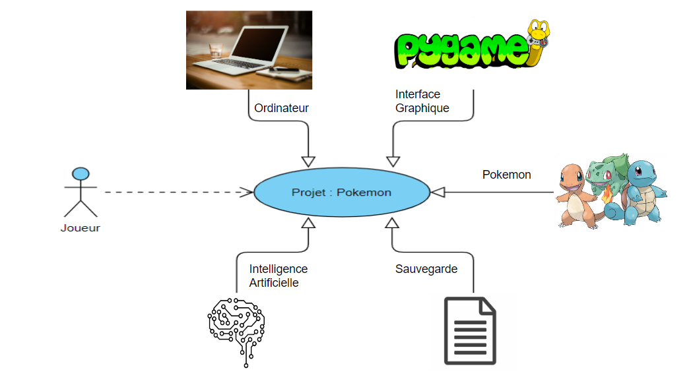
</details>
</br>

### <b><u> 2. Modélisation et analyse UML : </b></u>

### <b><u> 2.1 Diagramme des cas d'utilisation : </b></u>

<details>
<summary><u> Cas d'utilisation : </u></summary>

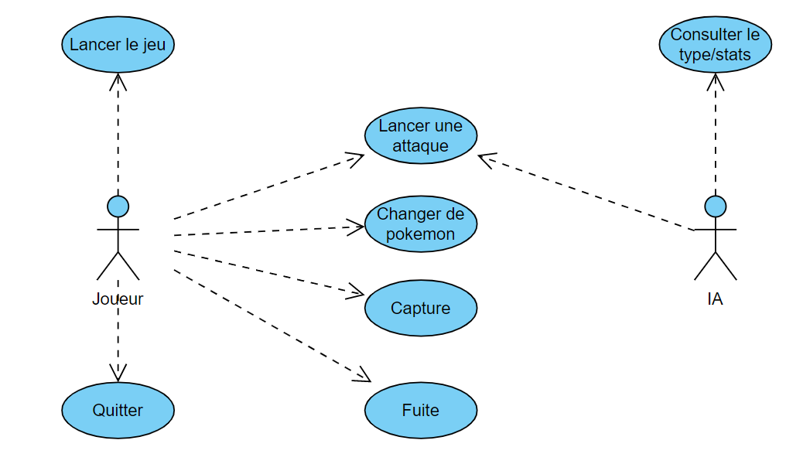
</details>
</br>

### <b><u> 2.2 Diagramme UML de notre projet : </b></u>
<details>
<summary><u> Afficher notre diagramme UML : </u></summary>

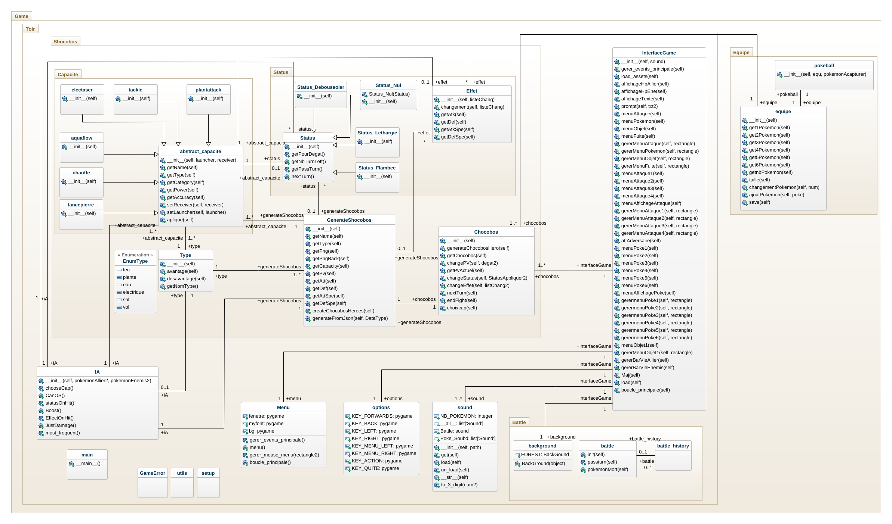
</details>
</br>

### <b><u> 2.3 Diagramme de séquence : </b></u>
<details>
<summary><u> Voici le diagramme de séquence de notre projet </u></summary>

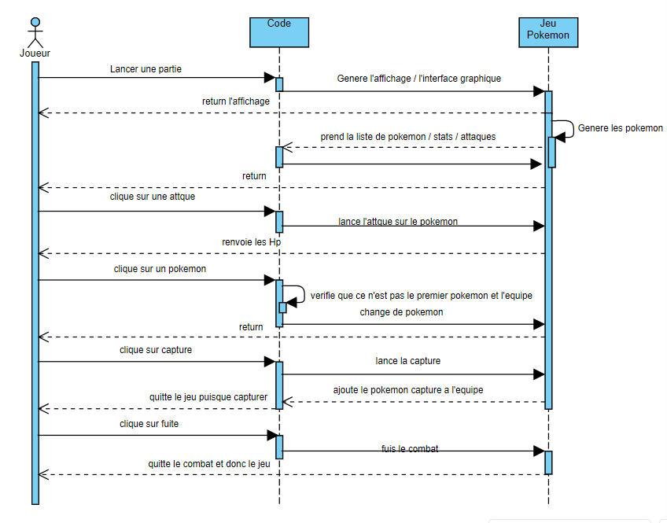
</details>
</br>

### <b><u> 2.4 Modélisation permettant le développement d'autre jeux : </b></u>

L'atout de notre projet c'est que nous avons une base graphique et un système de jeu en tour par tour, on pourrait donc garder cette même base mais changer les pokemon et faire en sorte d'avoir des combats de boss, comme une sorte de Final Fantasy, avec plusieurs personnages.

Mais également il est possible d'en faire un apport sur android puisque le jeu est assez petit et ne prend pas tellement de ressources il est possible de l'adapter sur android. Cependant il serait conseillé d'utiliser Kivy, système d'interface différent de pygame qui permet un apport sur mobile plus simple, nous verrons pourquoi nous n'avons pas choisi kivy dans la suite du rapport.

### <b><u> 3. Maquettage : </b></u> 

### <b><u> 3.1 Lancement d'une partie : </b></u>

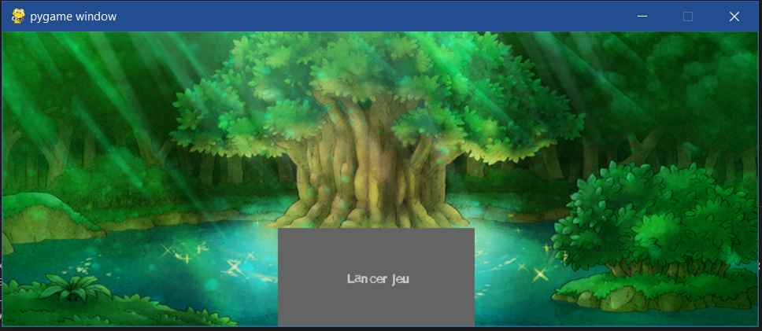

<details>
<summary><u> Rencontre avec un pokemon et lancement du combat : </u></summary>

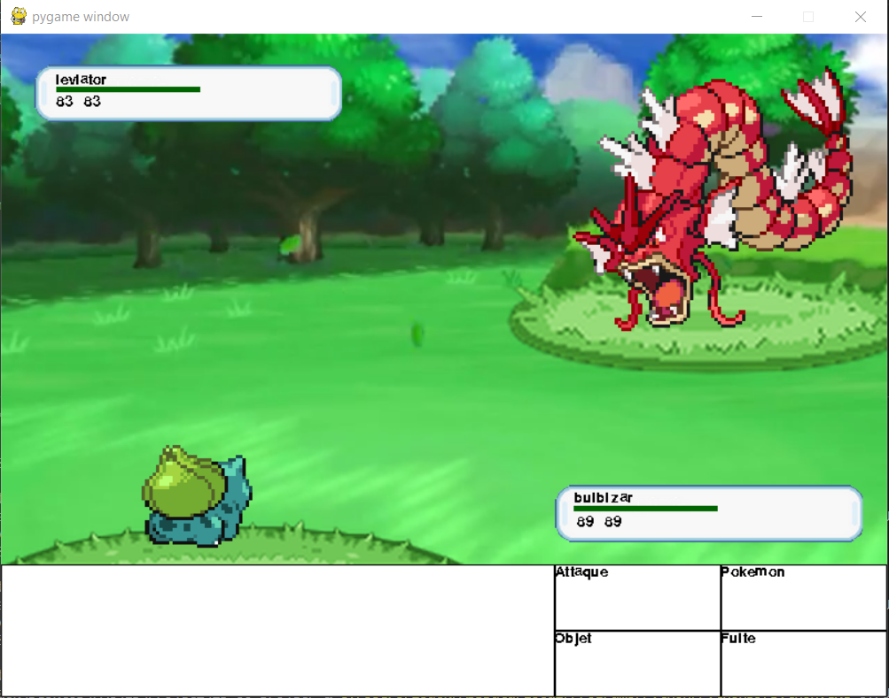
</details>
</br>
<details>
<summary> <u> Capture du pokemon échoué : </u></summary>

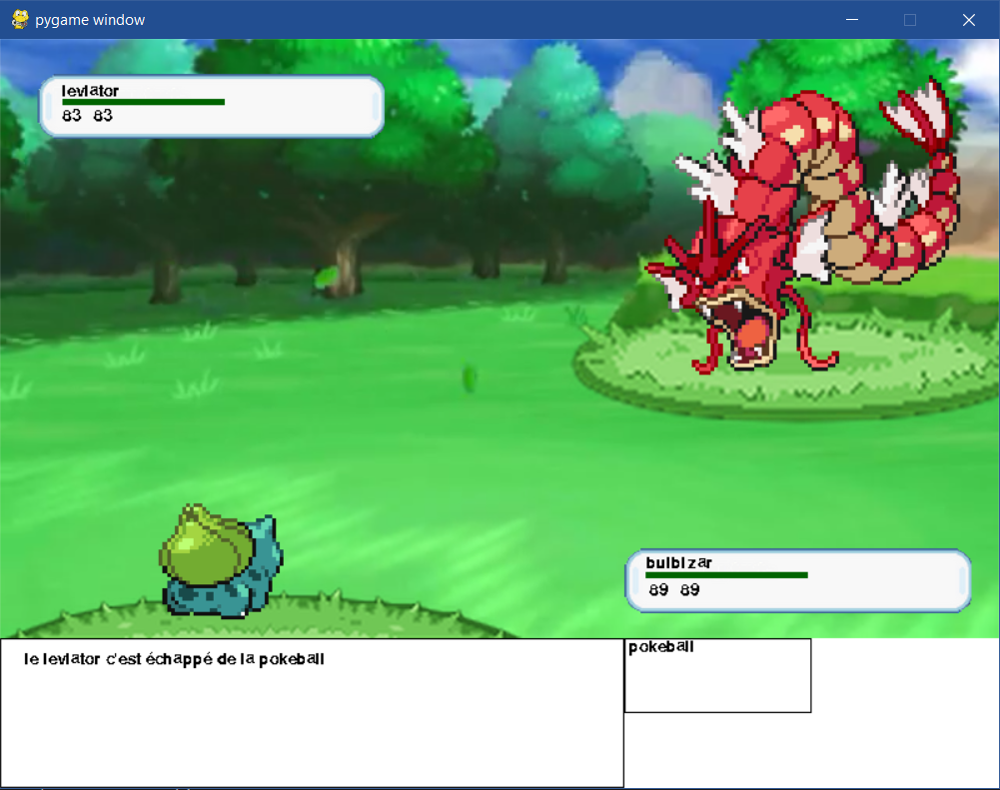
</details>
</br>
<details>
<summary><u> Capture du pokemon réussi : </u></summary>

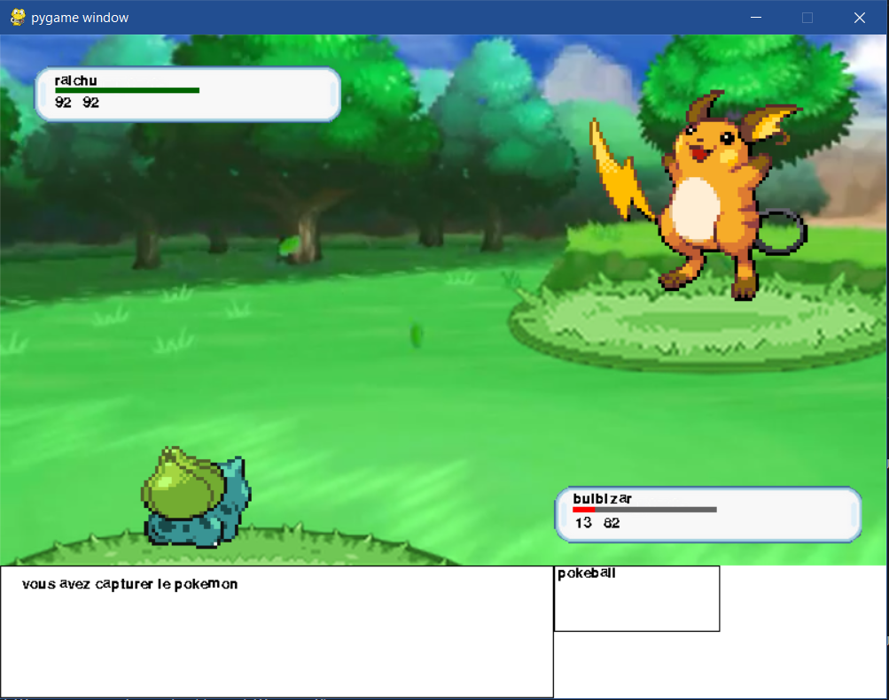
</details>
</br>
<details>
<summary><u> Sauvegarde de la capture du pokemon et affichage de l'équipe : </u></summary>

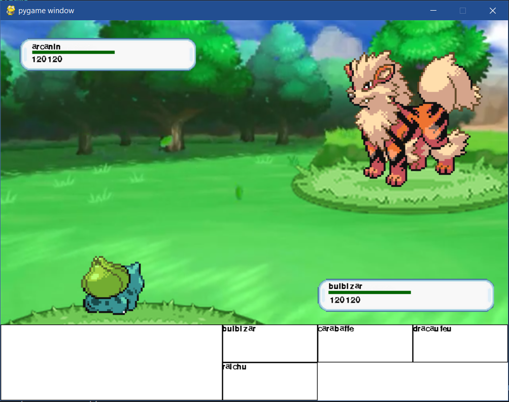
</details>
</br>
<details>
<summary><u> Lancement d'une attaque sur un pokemon et évolution de la barre Hp : </u></summary>

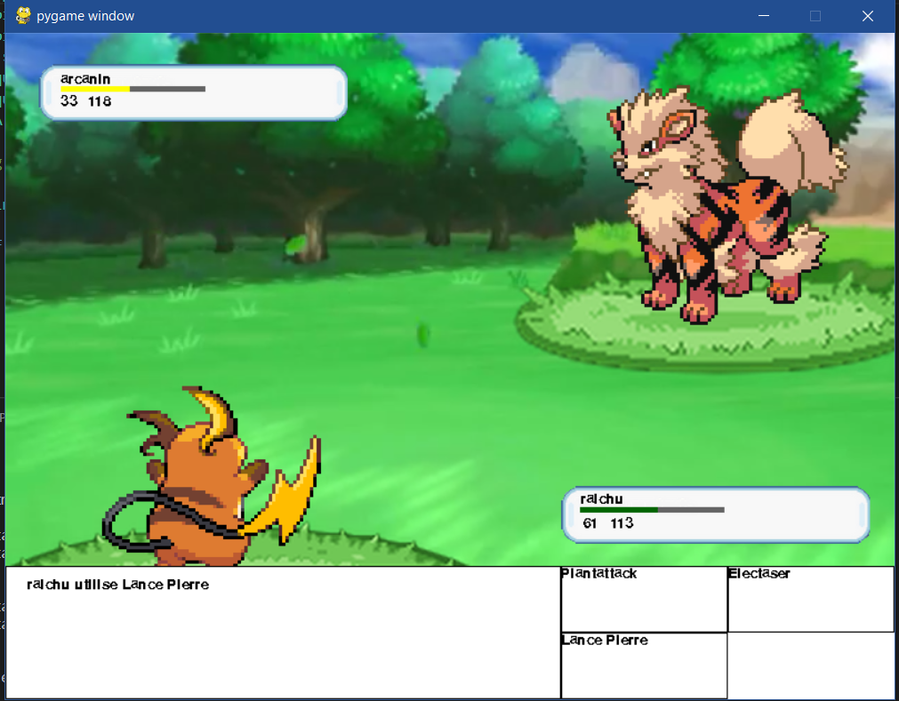
</details>
</br>

<details>
<summary><u> Affichage de toutes les attaques : </u></summary>

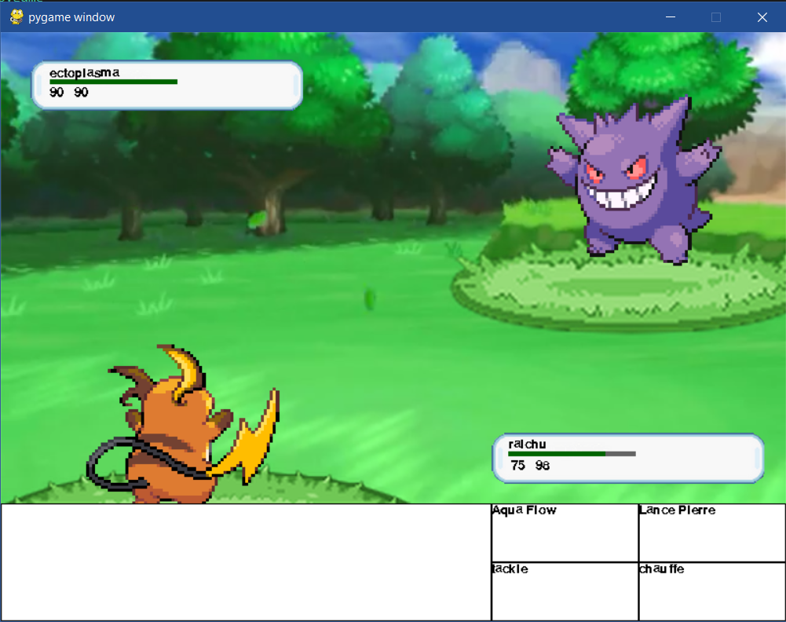
</details>
</br>

### <b><u> 4. Recette : </b></u>

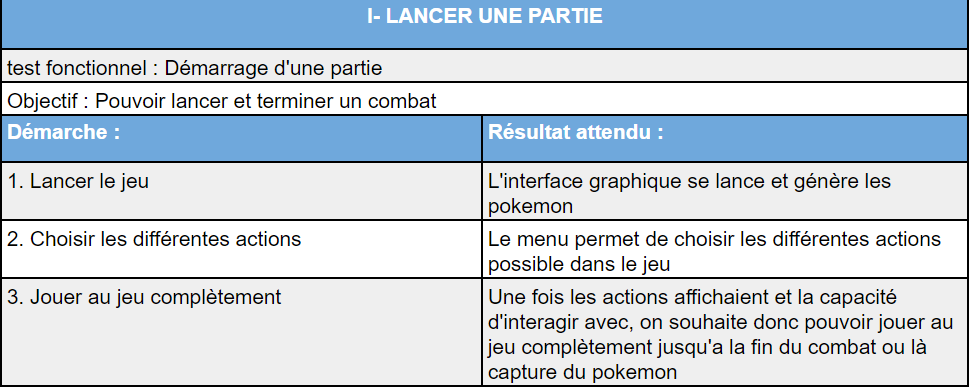

### <b><u> 5. Choix et solution : </u></b>

### <b><u> 5.1 Problèmes : </u></b>

- Nous avons eu un problème à la phase de réflexion du projet, car le jeu pokemon n'était pas notre première idée, le problème survint quand nous avons dû choisir sur quelle forme de jeu partir, de base nous avions l'idée d'un blind test or cela était trop simple, puis l'idée de faire une sorte de Guitar Hero nous est venue, mais encore une fois c'était un peu trop simple.

- Notre principal problème était de choisir le type de structuration pour nos données. Au final, on utilise les JSON, des énumération et d'autre système. Les raisons de notre choix seront expliquées dans une prochaine partie. (la 5.5) 

- Nous avons eu un autre problème sur la mise en place de Kivy qui était bien plus complexe que nous l'avions imaginé. Finalement, nous nous sommes tournés vers pygame. Même si la prise en main et son développement étaient plus simples et pratiques, nous avons dû tout de même tout apprendre, car nous ne l'avions jamais utilisé auparavant. Nous avons fait un tableau comparatif dans une partie suivante. (la 5.6)

- La mise à jour des hp et les attaques des pokemon l'un après l'autre nous a pris beaucoup de temps, en effet les deux attaques se lançaient en même temps. Pour regler cela, nous avons initialisé un ```delay```. 

- Un de nos problèmes les plus importants venait de la conception et non du code en lui-même, il y a quelques exceptions cependant. La plupart du temps nous avions une idée ou une vision de la chose et finalement, soit il y avait une manière plus facile et pratique de le faire comme par exemple pour les JSON, soit nous avons rencontré trop de difficultés à implémenter la conception voulue, alors nous sommes partis sur une version un peu plus simple à réaliser comme par exemple pour l'abstract class que nous voulions mettre en place.

- En effet c'est sur le abstract_capacite qui était censé être à la base une abstract méthode pour toutes les capacités, or nous avons eu pas mal de soucis à l'implémenter. Nous nous sommes donc orientés simplement sur un héritage qui nous a donné les mêmes avantages.

- Nous avons aussi bloqué sur les types, de base nous n'avions pas eu l'idée de mettre en place une énumération pour les types, c'est suite à une conversation pendant une séance que nous avons décidé de les utiliser et cela nous a permis de nous débloquer. 

- Nous avons aussi eu de la difficulté pour concentrer le projet, c'est-à-dire ne pas l'etendre trop, ne pas dupliquer du code par exemple pour l'interface. Pour être plus rapide nous n'avons parfois pas cherché à faire une méthode qui prenait en compte la gestion d'un index mais nous avons implémentés chaque méthodes (menuPoke1,menuPoke2...). Nous avons éssayés de corriger cela sur la fin du projet.

- Lors de la dernière semaine, nous avons eu plusieurs problèmes avec les doctests, ainsi que les tests en general. Pour les doctests malgré la méthode conseillée en séance sur le projet, nous n'avons pas réussi à les faire fonctionner. Ils sont néanmoins présents. Pour les tests, nous avons eu des problèmes avec les tuples mais également avec generatechocobo qui n'était pas trouvé via l'import pourtant correct, car il ne posait pas problèmes dans les autres classes. Nous avons donc deplacé generatechocobo dans chocobos.

- Une erreur qui subsiste encore dans notre projet est l'apparition de nom different pour plusieurs choses qui sont identiques par exemple Shocobos, Chocobos et Pokemon.

- Il n'y a pas la présence de test pour Chocobos et generatechocobo car ce n'est que de l'aléatoire, nous ne savons donc pas comment les tester correctement.

- Le projet étant assez ambitieux nous n'avons pas réussi à accomplir tout ce que nous souhaitions.


### <b><u> 5.2 Conception de l'IA : </u></b>

Pour l'IA "l'algo" consiste à lancer son attaque en traitant les informations pour que le coup soit le plus fort possible. Tout d'abord l'IA va prendre en priorité le fait de pouvoir tuer en un seul tour son adversaire, suite à cela il vérifie la meilleure option possible entre appliquer le status, appliquer un effet, ou bien alors descendre, via un effet, les statistiques du pokemon adverse s'il n'est pas possible de le tuer. Et Enfin si aucune de ces propositions est intéressante alors il va lancer une attaque simple en prenant en compte le type et les statistiques du pokemon pour faire la meilleure attaque possible.

### <b><u> 5.3 Amélioration primordiales : </u></b>

- Mise en place d'un serveur : 

Nous avions imaginé pourquoi pas si l'on continue le jeu de faire un serveur pour pouvoir jouer en ligne et donc non contre une IA.

- Ajout d'un deuxième pokemon pour des doubles battles :

- Ajout des statuts sur les attaques (les status ont été crées mais ils ne sont pas connectés aux attaques)

### <b><u> 5.4 Amélioration subsidiaires : </u></b>

- Ajout du double type
- Ajout d'un multiplicateur pour le bon type :

par exemple on améliore de *1.5 une attaque de votre pokemon si le pokemon est de même type que l'attaque qu'il lance.

- Ajout d'animation :
- Ajout de musique au lancement, de cri pokemon, de musique différente lorsque le pokemon a moins de 25% de ses Hp
- Ajouter différentes pokéballs pour avoir différents taux de capture :
- Ajout des pp :

### <b><u> 5.5 Nos choix sur la modélisation : </b></u>

Nous avons décidé d'avoir sous format JSON l'équipe et les différents pokemon implémentés dans le jeu car sous cette forme il est beaucoup plus facile de les sauvegarder ou alors de modifier des pokemon si besoin, en ajouter ou en supprimer.

Nous avons choisis également de faire une énumération pour les types, pour les mêmes raisons que pour les pokemon sauf que les pokemon ont plusieurs paramètres à prendre en compte, alors que le type comporte qu'un seul élément : son nom. Il est donc préférable d'en faire une énumération.

Nous avons donc convenu à rendre notre IA bien plus complexe pour pouvoir avoir une sensation de nostalgie pour rappeler les premiers pokemon qui étaient bien plus complexes que maintenant.

Nous avons aussi laissé le choix au joueur de lancer le combat (en lançant le jeu) ou alors de directement fuir en quittant la fenêtre.

### <b><u> 5.6 Choix interface : </b></u>

Nous avons longuement hésité au début du jeu sur l'interface que nous voulions utiliser, de base nous étions partie sur une interface graphique à l'aide de Kivy, qui nous aurait permis de faire un pokemon en 3D, et également d'apprendre à manipuler un système d'interface moins commun/connu et un peu plus poussé que pygame, cependant la prise en mains était un peu plus complexe et dû au temps et à notre hésitation et notre "stress" nous avons décidé de faire le jeu sous pygame.

Voici un Tableau Comparatif sur ces deux interfaces graphiques, contenant les avantages et inconvénients de chacun.

<details>
<summary><u> Tableau comparatif </u></summary>

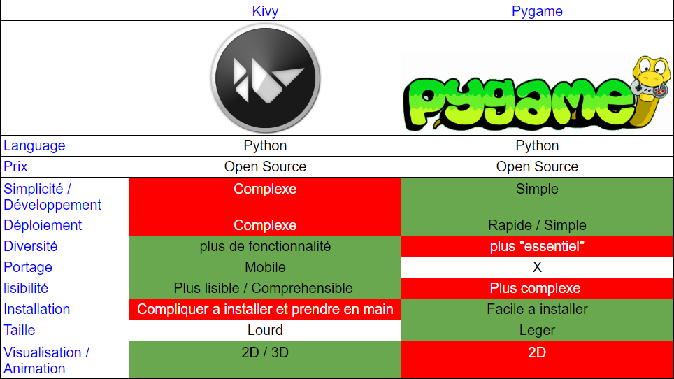
</details>
</br>

### <b><u> 6. Conclusion : </u></b>

Nous n'avons pas eu le temps de finir le jeu comme nous l'aurions souhaité pour ce rendu, cependant, le jeu est dans son ensemble complet, nous avons respecté le cahier des charges, les priorités que nous nous sommes fixé, et ce projet nous a permis d'acquérir de nouvelle connaissance / compétences, mais également de consolider nos compétences déjà acquissent.

Cela nous a permis d'apprendre à travailler en équipe, puisque nous avons connecté notre projet avec celui de TISSERAND Thibault et YANG Anthony, nous avons dû communiquer avec eux, comprendre leur vision, leur projet. Mais nous avons principalement travaillé en binôme sur un sujet qui nous intéresse et nous avons eu la possibilité de choisir notre propre projet, ce qui nous implique beaucoup plus dans le projet puisqu'il découle de notre choix.

Nous avons également pu établir une connexion, une mise en place d'une IA, ce qui n'est pas commun.

Avec notre projet, nous avons une base solide, pour créer un jeu similaire mais cette fois-ci "libre de droits" ou totalement personnel. Il suffira simplement de reprendre notre code et de le modifier ou alors l'améliorer. Par exemple pour notre idée de serveur si l'on vient à en faire un alors les utilisateurs auront un accès permanent au jeu.

Nous continuerons surement notre projet après avoir passé la date prévu pour pouvoir le rendre comme nous le voulions à la base.


